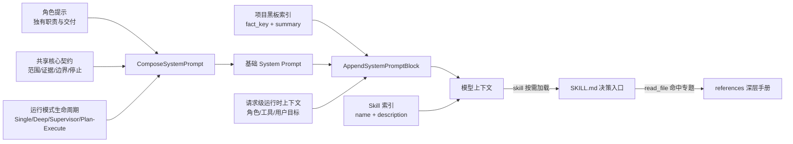
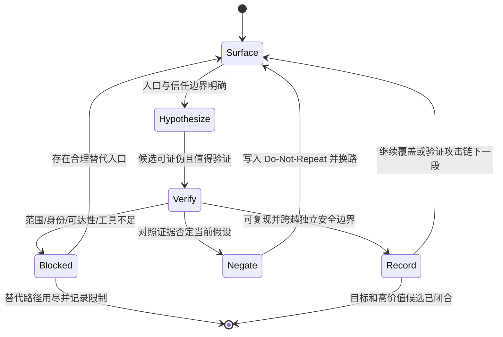

# 提示词与 Skill 架构

本文定义 CyberStrikeAI 的提示词职责、Skill 渐进披露和证据状态流。目标不是增加提示词长度，而是让运行模式共享同一套安全契约，让模型只加载当前任务真正需要的方法。

## 设计目标

- 角色提示只描述角色独有职责、输入前置、禁止项和可验收输出。
- 范围、证据闭环、独立安全边界、失败换路和停止条件只有一个代码来源。
- Skill 采用索引、入口、reference 三层披露，不把漏洞知识全集预载到系统提示。
- 扫描线索、静态命中和版本匹配保持 `tentative`，必须经过目标侧动态验证才能成为 `confirmed`。
- 单代理、Deep、Supervisor 和 Plan-Execute 交付相同质量的证据，只改变任务生命周期与协调方式。

## 模块职责

| 模块 | 位置 | 负责 | 不负责 |
| --- | --- | --- | --- |
| 角色定义 | `agents/*.md`、`internal/agent/default_single_system_prompt.go` | 独有职责、输入、禁止项、交付契约、专项 Skill 建议 | 重复通用安全规则和漏洞百科 |
| 共享契约 | `internal/projectprompt/contract.go` | 范围、证据循环、边界判定、恢复、Skill 路由、黑板、停止条件 | 具体攻击 payload 和角色工具清单 |
| 提示组合入口 | `projectprompt.ComposeSystemPrompt` | 按“角色 + 模式生命周期 + 共享契约”稳定组合 | 模板渲染和运行时数据查询 |
| 项目上下文 | `internal/project/blackboard.go` | 注入有预算的 `fact_key + summary` 索引 | 默认注入完整 PoC、请求响应和攻击链 |
| Skill 索引 | Eino `skill` 中间件 | 披露 `name + description`，支持模型选择 | 默认加载 Skill 正文 |
| Skill 入口 | `skills/*/SKILL.md` | 短决策树、触发/排除条件和下一层文件路径 | 承载所有专题清单 |
| Skill 细节 | `skills/*/references/*.md` | 请求矩阵、检查表、证据字段和专题方法 | 无条件进入模型上下文 |

职责边界保证角色变化不会改写通用安全约束，新增漏洞方法也不会导致所有模式的系统提示同步膨胀。

## 提示数据流



组合顺序是稳定接口：

```text
（可选）GPT 破甲指令 gptinstruct v42   ← 仅模型名 gpt-*/chatgpt-* 且 agent.gpt_instruct.enabled
→ 角色职责
→ 当前运行模式生命周期
→ 共享安全契约
→ 项目黑板索引与请求级上下文
→ 动态工具/Skill 索引
```

`gpt_instruct` 由 `internal/gptinstruct` 在 Eino 单/多代理 Instruction 组装末段**前置**注入，判定只看 `OpenAI.Model` 字符串，不看 provider。自定义单代理提示或 Markdown 主代理只能替换“角色职责”，不能替换共享契约。Deep、Supervisor、Plan-Execute 只注入各自的委派、转派或重规划差异；子代理统一追加单目标和禁止再次委派的生命周期。

## 证据状态机



`confirmed` 必须同时满足：固定攻击者起始状态、存在基线/攻击单变量对照、结果可复现、产生起始权限之外的新能力。扫描器输出、搜索结果、静态可达路径和版本/CVE 匹配只能进入 `Hypothesize`。

事实与漏洞记录分层：

- `upsert_project_fact` 保存资产、入口、身份、完整证据、负结果和可恢复上下文。
- `record_vulnerability` 只保存已验证 finding，写入前查重。
- 长会话只自动注入事实索引；需要细节时通过 `get_project_fact` 取回，禁止根据摘要补造 PoC。

## 全面评估状态机

“全面/完整/深度/包括品牌资产”不是提高 Top-N 数量，而是切换到有阶段门禁的评估协议：

```text
recon_sources → asset_ranking → frontend_api → auth_workflows
              → risk_matrix   → gap_review
```

每阶段只允许 `pending`、`active`、`passed`、`blocked`。`passed` 要求覆盖对象、执行工具或请求、产出计数和证据位置；`blocked` 要求原始失败和已经尝试的替代路径。仍有 `pending/active` 或当前可执行的高价值 `gap/tentative` 时，只能输出进度更新。

关键阶段的验收边界：

- **侦察**：Deep 根域强制执行 `subfinder`、`oneforall`、`dnsx`，再按类别使用可用的证书透明度、历史数据、品牌证据和空间测绘来源。异构来源按 raw、去重后、增量统计；工具失败不会被解释为“无资产”。
- **资产分级**：共享 IP 不能独立证明品牌归属；确认范围内的资产按业务、认证/管理、数据、输入、边界和暴露证据评分。Top-N 只控制顺序。
- **JS/API**：资源按 `queued → fetched → analyzed → expanded` 递归；端点按 `discovered → extracted → baselined → risk-mapped → verified/negated/blocked` 推进。SPA shell 的统一 200 只能否定猜测路径，不能批量否定真实调用。
- **身份态**：范围允许且不会产生付费、轰炸或真实用户影响时创建最少账号；需要对象授权差分时使用账号 A/B 与各自测试对象。需要邀请、实名、人工审批或不可控第三方动作时记录阻断，不伪造验证码或批量注册。
- **验证**：根据真实端点能力映射认证/会话、对象/功能授权、注入、服务端处理、文件、代理边缘、业务状态机/并发和组件暴露。扫描命中只创建候选。

因此，“SSH 待验证”“代理端口待验证”“JS 路由表下一步处理”这类仍可在当前范围内执行的内容只能出现在阶段交接中。若它们出现在最终草稿，协调器必须撤销收尾并继续路由；只有超出范围、身份、可达性、时间或替代路径已经用尽的项才能进入最终限制。

## Skill 路由 DSL

测试深度与编排模式相互独立。最小路由可表示为：

```text
route(task) = scan(depth(task))
            + domain(primary_surface(task))
            + verify(candidate(task))
            + optional(recording_or_reporting(task))
```

约束如下：

```text
depth 未指定      => pentest-scan-standard
scan              => quick | standard | deep 中恰好一个
domain            => 当前主要攻击面恰好一个
verify            => 需要确认/否定候选时加载 pentest-verification
blackboard/report => 只有需要字段模板或最终格式时按需加载
references        => 只有入口决策命中专题时读取一个相关文件
```

典型路由：

| 场景 | 最小集合 |
| --- | --- |
| 快速连通性或 CI 冒烟 | `pentest-scan-quick` + `attack-surface-recon` + `pentest-verification` |
| 源码或部署配置可用 | `pentest-scan-standard` + `source-aware-whitebox` + `pentest-verification` |
| API/BOLA | `pentest-scan-standard` + `api-security-testing` + `pentest-verification` |
| 浏览器与 CLI 存在受控边缘差分 | `pentest-scan-standard` + `cdn-tls-fingerprint` + `pentest-verification` |

用户明确指定深度时替换扫描模式，不叠加第二个扫描模式。多领域任务先按当前证据选择主攻击面，闭合或换路后再加载另一个领域 Skill，禁止一次加载宽泛全集。

## 预算与质量门槛

| 对象 | 静态预算 | 约束目的 |
| --- | ---: | --- |
| 共享核心契约 | 约 2–3K 字符 | 所有模式稳定携带，避免上下文基础成本失控 |
| 单个角色正文 | 不超过 4K 字符 | 保持角色职责清晰，不重复共享规则 |
| 宽泛 Skill 入口 | 不超过 3K 字符 | 只保留决策树，把矩阵下沉到 references |
| 项目事实索引 | 由 `ProjectConfig` 动态限制 | 长会话可恢复，同时不注入完整历史 |
| 工具与 Skill 索引 | 运行时动态生成 | 不计入静态提示预算，但仍受中间件裁剪 |

回归测试必须覆盖：

- 每个运行模式都包含且只包含一份共享契约区块。
- 自定义角色不能覆盖共享契约。
- 16 个 bundled Agent 均有唯一职责且正文不超过预算。
- 所有 bundled `SKILL.md` 通过 Agent Skills front matter 校验，目录名与 `name` 一致，引用文件存在。
- Quick、白盒、API/BOLA、边缘/CDN 路由得到不同且不超过三项的最小集合。
- 宽泛 Skill 入口正文不超过预算。

## 扩展规则

新增角色时：

1. 先判断职责是否已属于现有角色；仅工具不同不构成新角色。
2. 写清所需输入、唯一职责、禁止项和交付结构。
3. 不复制共享契约标题或通用失败处理。
4. 专项方法只引用 Skill 名，不在角色正文展开漏洞清单。

新增 Skill 时：

1. `description` 同时写明“何时使用、何时不使用、预期产物”，使索引本身足以路由。
2. `SKILL.md` 只保留触发条件、决策树和最小流程；长清单放入 `references/`。
3. 标签写入 `metadata.tags`，目录名必须与 `name` 一致。
4. 新场景若能复用现有扫描/验证 Skill，只新增领域 Skill，避免复制状态循环。
5. 任何自动化或静态输出都保持 `tentative`，在目标侧完成证据闭环后才能升级。

## Strix 参考与取舍

本设计参考 [usestrix/strix](https://github.com/usestrix/strix) 的公开架构与文档。参考项目与 CyberStrikeAI 均声明采用 Apache License 2.0；这里以设计思想重新实现，没有复制其系统提示正文或运行时代码。

借鉴的部分：

- 根协调者与专项执行者的职责隔离。
- `quick`、`standard`、`deep` 测试深度。
- 源码感知分析与目标侧动态 PoC 的闭环。
- 多代理共享发现、验证 finding，并控制子任务上下文。
- Skill/专项知识按任务加载，而不是全部常驻。

明确不照搬的部分：

- 不采用大型单体系统提示；共享规则由 Go 组合器集中维护。
- 不强制构造固定规模 Agent 树；只有存在专项上下文收益时才委派。
- 不以固定步骤数或口号式深度衡量质量；以攻击面覆盖和候选闭合为准。
- 不引入独立 Python Agent/Sandbox 服务；继续复用现有 Go、MCP 和 Eino 中间件。
- 不默认加载大规模漏洞知识；领域入口和 references 按证据逐层读取。

后续调整若使角色重新包含通用契约、Skill 入口持续增长或路由一次加载多个宽泛领域，应优先重划模块职责，而不是提高预算上限。